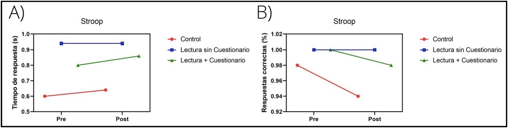
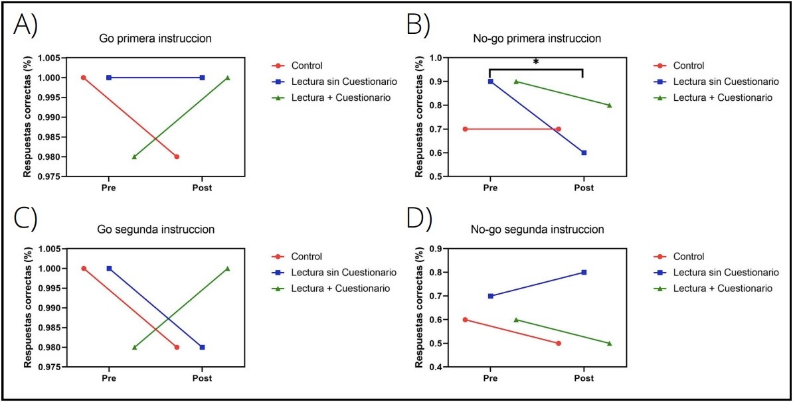
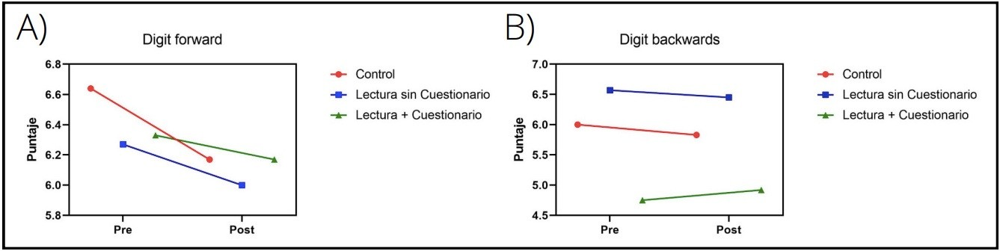

# **Lectura y Funciones ejecutivas**

Integrantes:
* Espinoza Ulloa Abril Celeste 
* Fuentes Baños Diego 
* Gonzalez Vallejo Monserrat
* Mozo Martinez Airy 
* Roa Gutierrez Camila
* Valero Dorado Sebastian 
* Valle Rivas Joan

## **Índice**
* [Introducción](#introducción)
* [Método](#método)
* [Resultados](#resultados)
* [Discusión](#discusión)

## **Introducción**

Las funciones ejecutivas pueden ser definidas como las rutinas responsables de la monitorización y regulación de los procesos cognitivos durante la realización de tareas cognitivas complejas (Miyake et al., 2000). También se consideran como el conjunto de actividades que se desarrollan en el área prefrontal. Mediante estas funciones se construye la esencia de nuestra conducta y de toda la actividad mental, constituyéndose como el ordenador central del ser humano, además de ser las encargadas de resolver problemas que requieren razonamiento, abstracción o el uso de códigos simbólicos (Portellano, 2022).

Según Portellano et al. 2009, las funciones ejecutivas que están directamente relacionadas con el aprendizaje y por consiguiente con el rendimiento académico, incluyen los siguientes componentes:

* *Flexibilidad mental*: Permite adaptar las respuestas a las nuevas situaciones o estímulos. Por lo tanto, se generan nuevos patrones de conducta ofreciendo alternativas diversas. 
* *Fluidez verbal*: Relacionada con la flexibilidad mental, ya que es la que permite responder con rapidez y exactitud. Se mide con pruebas de fluidez verbal fonológica y semántica.
* *Regulación atencional*: Permite que se puedan llevar a cabo todos los procesos cognitivos. Por consiguiente; proporciona al ser humano una mejor atención selectiva y mantenida, así como un dominio en la capacidad de inhibir y controlar la conducta (Anderson y Jacobs, 2002).
* *Memoria de trabajo*: Se refiere a la capacidad que nos permite mantener en mente los elementos que necesitamos para realizar una tarea mientras la estamos ejecutando (CogniFit, 2016).
* *Control inhibitorio*: Regula o retrasa las respuestas impulsivas modelando la conducta y la atención como catalizadores del procesamiento de la información en los procesos cognitivos.

En el presente estudio nos centramos en la regulación atencional, memoria de trabajo y control inhibitorio de los participantes.

Por otra parte, la lectura es una habilidad crucial en el ámbito académico, pues es fundamental en el proceso de enseñanza y aprendizaje al igual que para el desarrollo lingüístico e intelectual. Existen infinidad de artículos que señalan cómo la lectura repercute en la biología y estructura del cerebro. Estudios con resonancia magnética han señalado que la lectura implica una red compleja de circuitos y señales en el cerebro donde, a medida que madura su capacidad de lectura, esas redes también se fortalecen y se vuelven más sofisticadas (Burgess, 2004b).

En la variedad que el lenguaje nos permite, hay diferentes tipos de textos que van a tener tanto una estructura como un contenido distinto y que estarán dirigidos a lo que se pretende transmitir. Por ejemplo, el texto narrativo es el relato de una secuencia de hechos o acciones, ocurridas en un espacio y momento determinado. Se puede tratar de una historia real o ficticia que se caracteriza por recrear los lugares, personajes, acciones y emociones. Los textos narrativos están destinados a la lectura de entretenimiento o la enseñanza moral y suelen seguir la teoría de la gramática de la historia (Mandler & Johnson, 1977). La historia del texto narrativo enlaza una serie de acontecimientos a medida que van ocurriendo, por lo que se puede identificar el inicio, nudo y desenlace de la misma. Estos hechos son descritos por el narrador que relata la historia, bien sea que participe o no de manera directa en los acontecimientos (Rumelhart, 1980).

Para esta investigación se eligió el género de texto narrativo basándonos en estudios que señalan que, a comparación de otros géneros, el texto narrativo es el que muestra mayores cambios en componentes necesarios en las funciones ejecutivas como lo es la memoria. Un estudio de Jacobs en 2017 encontró cómo el género de textos afecta el rendimiento de recuerdo de los alumnos; las superestructuras expositivas ayudan a los lectores a recordar información textual superficial, mientras que las superestructuras narrativas apoyan la memorización de proposiciones abstractas (A. M. Jacobs, 2017). 

De igual manera, en 2021 McClure, Chen y Thomas analizaron los géneros literarios en términos de superestructuras y compararon los efectos de diferentes géneros sobre el recuerdo de la memoria y la influencia del comportamiento, encontrando que aquellos que leyeron un texto narrativo tenían mejora en memory recall (recuperación de memoria) que los que leyeron textos expositivos (McClure, Chen y Thomas, 2021), hipotetizando que aquellos que leen textos narrativos tienen una mejora en *memory recall* debido a que los lectores son capaces de asociarse y relacionarse fácilmente con la historia presentada.

Un ejemplo de cómo los textos narrativos modifican la conexión neuronal es el estudio realizado en 2013 por Berns et al. donde  investigadores utilizaron imágenes de resonancia magnética funcional para medir el efecto de leer una novela en el cerebro. Los participantes del estudio leyeron la novela “Pompeya” durante un período de 9 días. A medida que aumentaba la tensión en la historia, más y más áreas del cerebro se iluminaban con actividad. Los escáneres cerebrales mostraron que durante el período de lectura y durante los días posteriores la conectividad cerebral aumentó, especialmente en la corteza somatosensorial, la parte del cerebro que responde a las sensaciones físicas como el movimiento y el dolor (Berns et al., 2013).

Nosotres pretendemos observar si leer un texto narrativo de dos páginas por cinco días demuestra una mejora en las funciones ejecutivas. Se evaluaron los componentes de atención, memoria de trabajo e inhibición utilizando las pruebas neuropsicológicas Stroop –para medir control inhibitorio–, Go No Go –midiendo regulación atencional y control inhibitorio– y Digit Span para medir memoria de trabajo.

## **Método** 

### *Participantes*
En este estudio cuantitativo se reclutó a 15 personas que tuvieran entre 18 y 22 años, durmieran entre 6 y 8 horas diarias, no tuvieran trastornos del sueño y no leyeran textos narrativos. Se formaron tres grupos de estudio: control, lectura sin cuestionario y lectura con cuestionario; con cinco integrantes en cada grupo elegidos aleatoriamente.

### *Pruebas neuropsicológicas*
Para la medición de las funciones ejecutivas se utilizaron tres pruebas neuropsicológicas: Stroop, Go No Go y Digit Span. Estas pruebas fueron aplicadas presencialmente en un ambiente con los menores distractores posibles y realizadas en sistemas de cómputo con PsychoPy, un software de código abierto utilizado para la realización de experimentos relacionados con ciencia conductual.

La prueba Stroop fue la primera en aplicarse. Esta consiste en presentar al participante series de letras (e.g. “xxxxx”) o nombres de colores (e.g. verde, azul, rojo) con el texto coloreado únicamente de rojo, verde, amarillo o azul. El participante debía responder el color del texto que se le presentara presionando la tecla “A” para el color rojo, “S” para el verde, “D” para amarillo y “F” para azul. En las computadoras que se realizó la prueba, cada tecla estaba marcada con un sticker del color correspondiente. En total se presentaban 48 estímulos (palabras o series de letras) y cada uno se sostenía hasta que el participante respondiera. 

A continuación se aplicaba la prueba Go No Go. En la primera fase se le pedía al participante presionar la barra espaciadora del teclado cuando la letra equis (x) apareciera en la pantalla (Go primera instrucción), mientras que si se mostraba cualquier otra letra (e.g. “n”, “p”, “t”) no tenía que presionar la barra espaciadora (No go primera instrucción). Después, para la segunda fase, se le pedía al sujeto presionar la barra espaciadora cuando apareciera cualquier letra que no fuera la letra equis (x) [Go segunda instrucción]  y no presionar la barra espaciadora cuando la letra fuera equis (x) [No go segunda instrucción]; la instrucción contraria a la primera. Un total de 50 palabras eran presentadas por cada fase.

Finalmente, los sujetos realizaban la prueba Digit Span. Primero realizaban la prueba Digit Span Forward, donde una serie de números se mostraban en la pantalla, uno por uno, y se le pedía al participante escribir los dígitos en el orden que aparecieron. Cada que escribían bien toda la secuencia un dígito se aumentaba al total de dígitos del intento pasado, por lo que al inicio eran tres dígitos. Si contestaba correctamente, el segundo intento era de cuatro dígitos; pero si el participante se equivocaba se le restaba un dígito al total del intento, tomando en cuenta que tres es la cantidad mínima de dígitos de la prueba. Se presentaban un total de 14 intentos y después de estos intentos se cambiaba a la prueba Digit Span Backward. En esta cambia la instrucción a los participantes; ahora debían escribir la serie de números presentada de forma inversa, es decir, del número final al primero presentado. Las reglas de aciertos y fallos permanecen igual, al igual que el total de intentos.

### *Lecturas*
Los grupos “Lectura con cuestionario” y “Lectura sin cuestionario” recibieron por cinco días distintos textos narrativos con una extensión de aproximadamente dos cuartillas. Los textos elegidos fueron: “Claroscuro” de Nella Larsen, “El cuaderno de Maya” de Isabel Allende, “El caso de Charles Dexter Ward” de H.P. Lovecraft, “El lugar donde crece la hierba” de Luisa Josefina Hernández y “Lenguas de piedra” de Sylvia Plath.

Se le pidió a los participantes que leyeran el texto proporcionado antes de irse a dormir, en un ambiente cómodo con mínimos distractores. Por lo tanto, no debían usar aparatos electrónicos para otra actividad que no fuera para la lectura. 

### *Experimento*
Una vez los grupos formados se le solicitó a cada integrante su asistencia a la Facultad de Ciencias —campus Ciudad Universitaria— de la UNAM para la realización de las pruebas neuropsicológicas. El primer día se aplicaron las tres pruebas neuropsicológicas. Para los grupos “Lectura con cuestionario” y “Lectura sin cuestionario” esa misma noche se les proporcionó la primera lectura a los participantes. En cambio al grupo “Control” no se le envió nada. 

Al grupo “Lectura con cuestionario” se les enviaba, además del texto narrativo, un cuestionario con cinco preguntas sobre la lectura que se les había proporcionado. Esto con el fin de asegurarnos que habían leído el texto.

Una vez pasados cinco días de la aplicación de las pruebas, se le solicitó nuevamente a los integrantes su asistencia en la ubicación ya mencionada para aplicar las tres pruebas neuropsicológicas.

### *Análisis de datos*
La estadística de los datos recabados en las pruebas neuropsicológicas fue realizada mediante el programa Prism Graphpad. La base de datos usada fue construida usando Python y csv, debido a su facilidad de visualización. 
El parámetro utilizado para el análisis fue el promedio del puntaje obtenido sobre el puntaje total de la prueba —su número de aciertos—. 

## **Resultados**

En la prueba Stroop se midió el tiempo de respuesta y las respuestas correctas. Se observó un aumento en el tiempo de respuesta en todos los grupos menos en el de lectura sin cuestionario, aunque estos datos no fueron significativos. Sorprendentemente hubo un decremento en las respuestas correctas de los mismos grupos que aumentaron el tiempo de respuesta (“control” y “lectura con cuestionario”). El grupo “Lectura sin cuestionario” tuvo todas las respuestas correctas tanto en las pruebas pre como en las post, manteniendo, de igual manera, su tiempo de respuesta de casi un segundo.

> *Figura 1*: Prueba Stroop de grupo control, grupo lectura y grupo lectura mas cuestionario. (A y B)  (A) Comparación de tiempo de respuestas de pruebas pre y post de los tres grupos (B) Comparación de los porcentajes de respuestas correctas en pruebas pre y post de los tres grupos. Análisis U de Mann-Whitney y nivel de confianza del 95%.

Con respecto a la prueba Go No Go, se midió las respuestas correctas en las cuatro modalidades. En Go primera instrucción el grupo “Control” decreció, mientras que el grupo “Lectura sin cuestionario” se mantuvo y el grupo “Lectura con cuestionario” incrementó sus aciertos, pero ninguno de estos datos fue significativo. Sin embargo hubo un decremento significativo en el grupo “Lectura sin cuestionario” en la tarea No Go primera instrucción, mientras que el grupo “Control” mantuvo sus aciertos y el grupo “Lectura con cuestionario” tuvo una disminución no significativa en sus respuestas correctas.

Asimismo, se observó una disminución en las respuestas correctas de la prueba Go segunda instrucción en los grupos “Control” y “Lectura sin cuestionario”, contrario al grupo “Lectura con cuestionario” el cual mostró un aumento en los aciertos, ninguno de estos datos fue significativo. Para No Go segunda instrucción los grupos “Control” y “Lectura con cuestionario” disminuyeron en las respuestas correctas y el grupo “Lectura sin cuestionario” aumentó en aciertos, de igual manera ninguno de los datos fue significativo.

> *Figura 2*: Porcentaje de respuestas correctas en la prueba Go no Go de los tres grupos, comparación pre y post. (A) porcentaje de respuestas de los tres grupos cuando se marca correctamente al aparecer la “x” en la pantalla. (B) Porcentaje de respuestas correctas cuando no se marca cualquier otra letra distinta a “x” al aparecer en la pantalla (*P<0.0397). (C)  Porcentaje de respuestas correctas de los tres grupos cuando se marca correctamente cualquier otra letra diferente a “x” al aparecer en pantalla. (D) Porcentaje de respuestas correctas cuando no se marca la “x”. Análisis U de Mann-Whitney y nivel de confianza del 95%.

Finalmente, en la prueba Digit Span Forward hubo un decremento no significativo en el puntaje de los tres grupos. Por el contrario, en la prueba Digit Span Backward el grupo “Lectura con cuestionario” tuvo un aumento no significativo, el resto de los grupos mostró una disminución no significativa.

> *Figura 3*: Puntajes de la prueba Digit Span. (A) Comparación puntajes de las pruebas pre y post  digit forward de los tres grupos. (B) Comparación puntajes de las pruebas pre y post  digit backwards de los tres grupos. Análisis U de Mann-Whitney y nivel de confianza del 95%.

## **Discusión**

En este estudio se realizaron lecturas de género literario, y junto a tres pruebas neuropsicológicas computacionales estandarizadas (Stroop, Go No Go y Digit Span) se buscó medir la relación del hábito de lectura la memoria de trabajo, sin embargo, se optó por centrarnos en la relación lectura-funciones ejecutivas por el tipo de características que contaban las pruebas, las cuales presentaban resultados más prometedores respecto a las funciones ejecutivas. 

Con lo anterior como base de la investigación, se buscó la relación de la lectura con el mejoramiento de las funciones ejecutivas en jóvenes estudiantes de nivel licenciatura en un rango de edad entre los 18 a 22 años. Esto debido a que los lectores son capaces de construir e integrar información de diversas fuentes, mientras que lo recabado se agrega al conocimiento ya adquirido, pues estas habilidades se relacionan mediante la decodificación y el lenguaje oral. (Spencer et al., 2019). 

Se buscó que los estudiantes participantes estudiaran carreras en las cuales el hábito de lectura de género literario narrativo fuera de mínimo a nulo, dicha muestra fue distribuida en tres grupos de manera aleatoria para no tener diferencias entre los grupos. Conforme la investigación se fue desarrollando, el número de la muestra disminuyó debido a que algunos participantes (n=15) fueron dejando su participación del experimento por factores como: problemas en la organización de horarios, pérdida del interés en participar en la pruebas o no cumplieron con las indicaciones que se le presentaron al principio de la investigación. Esta disminución llevó a la pérdida de datos que pudieron haber sido significativos. Por otro lado, del número de participantes que participaron solamente se encontró un outlier, el cual sí fue considerado en el análisis de datos.

Con relación a las pruebas, se encontró una disminución de las funciones ejecutivas en la mayoría de las pruebas, sin embargo en ningún caso fue significativa. Solamente se encontraron valores significativos en dos pruebas, la primera fue entre los valores pre-post de la prueba No Go primera instrucción, donde se presentó una disminución de las funciones ejecutivas en el grupo de lectura sin cuestionario, sin embargo estos resultados pueden ser por factores de los estudiantes de nivel licenciatura como: estrés, cansancio o ansiedad generado por la licenciatura que cursan, factores que no habían sido contemplados al momento de realizar las pruebas.
Por otro lado, la prueba Stroop pre, presentó valores significativos entre los grupos control y el de lectura, resultados que posiblemente tienen relación con el modo que se aplicaron las pruebas, donde no se consideraron factores externos como: ruidos externos al de la sala de aplicación, estrés, ansiedad o cansancio generados por la licenciatura y distracción porque realizaron las pruebas con otros participantes al mismo tiempo. 
Con los resultados anteriores, no se pudieron encontrar valores significativos de mejoramiento de las funciones ejecutivas gracias a la lectura. Sin embargo esta investigación puede ser replicable y ampliar los datos siendo posible encontrar diferencias importantes entre los grupos. Por lo tanto, en las próximas investigaciones se podría intentar replicar la investigación con una muestra con más participantes, controlar mejor los factores externos al momento de realizar las pruebas, cuidando factores psicológicos de los participantes como ansiedad y estrés. 

## **Referencias**

* Miyake, A., Friedman, N. P., Emerson, M. J., Witzki, A. H., Howerter, A. & Wager, T. D. (2000). The Unity and Diversity of Executive Functions and Their Contributions to Complex “Frontal Lobe” Tasks: A Latent Variable Analysis. Cognitive Psychology, 41(1), 49-100. https://doi.org/10.1006/cogp.1999.0734

* Portellano, J. A. (2022). Introduccion A La Neuropsicologia (1.a ed.). MCGRAW HILL EDDUCATION.

* Jacobs, R. & Anderson, V. (2002). Planning and Problem Solving Skills Following Focal Frontal Brain Lesions in Childhood: Analysis Using the Tower of London. Child Neuropsychology, 8(2), 93-106. https://doi.org/10.1076/chin.8.2.93.8726

* CogniFit. (2016, 8 junio). Memoria de Trabajo. Memoria de Trabajo o Memoria Operativa - Habilidad Cognitiva. https://www.cognifit.com/mx/habilidad-cognitiva/memoria-de-trabajo

* Paul W. Burgess. (2004b). Theory and Methodology in Executive Function Research. Methodology Of Frontal And Executive Function, 87-121. https://doi.org/10.4324/9780203344187-8

* Mandler, J. M. & Johnson, N. S. (1977). Remembrance of things parsed: Story structure and recall. Cognitive Psychology, 9(1), 111-151. https://doi.org/10.1016/0010-0285(77)90006-8

* Rumelhart, D. E. (1980). On Evaluating Story Grammars*. Cognitive Science, 4(3), 313-316. https://doi.org/10.1207/s15516709cog0403_5

* Berns, G. S., Blaine, K., Prietula, M. J. & Pye, B. E. (2013). Short- and Long-Term Effects of a Novel on Connectivity in the Brain. Brain Connectivity, 3(6), 590-600. https://doi.org/10.1089/brain.2013.0166

* Jacobs, A. M. (2017). Affective and Aesthetic Processes in Literary Reading. Cognitive Literary Science, 303-325. https://doi.org/10.1093/acprof:oso/9780190496869.003.0016

* McClure, K., Chen, H.-T., & Thomas, M. (2021). Literature Genre Effects on Memory and Influence. 14.

* Spencer, M., Richmond, M. C., & Cutting, L. E. (2020). Considering the Role of Executive Function in Reading Comprehension: A Structural Equation Modeling Approach. Scientific studies of reading : the official journal of the Society for the Scientific Study of Reading, 24(3), 179–199. https://doi.org/10.1080/10888438.2019.1643868

* Restrepo, G., Calvachi, L., Cano, I.C., & Ruiz, A.L. (2019). Las funciones ejecutivas y la lectura: Revisión sistemática de la literatura. Informes Psicológicos, 19(2), pp. 81-94  http://dx.doi.org/10.18566/ infpsic.v19n2a06
